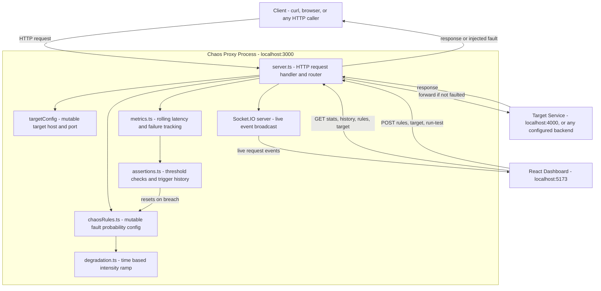

# Chaos Proxy

A hand-built HTTP proxy (Node.js + TypeScript) that sits between a client and a backend service, deliberately injecting realistic, time-varying network faults so you can observe how a system behaves under degraded conditions. It includes a live control API, a real-time React dashboard, and a safety mechanism that automatically disables chaos if failure conditions cross a configured threshold.

Built from scratch using Node's raw `http` module, without a proxying library such as `http-proxy`, so that request/response streaming, connection handling, and fault injection are implemented and understood directly rather than abstracted away by a dependency.

## Table of contents

- [Purpose](#purpose)
- [Architecture](#architecture)
- [Request lifecycle](#request-lifecycle)
- [What is implemented](#what-is-implemented)
- [Core concepts explained](#core-concepts-explained)
- [API reference](#api-reference)
- [Dashboard](#dashboard)
- [Running locally](#running-locally)
- [Configuration](#configuration)
- [Known limitations](#known-limitations)
- [Usage warning](#usage-warning)
- [Future scope](#future-scope)
- [Tech stack](#tech-stack)

## Purpose

Chaos engineering answers one specific question: when a service that another service depends on becomes slow or fails, does the dependent service handle that failure gracefully, or does the failure cascade into a larger outage. This proxy exists to let that question be tested deliberately, in a controlled environment, without needing a real backend to actually be broken.

The proxy sits between a caller and a target service. It can inject a fake failure response without ever contacting the target, or add artificial latency before forwarding a request normally. Because HTTP responses generated this way are indistinguishable from real failures at the protocol level, any client or service calling through the proxy reacts exactly as it would to a genuine outage, which is what makes this technique useful for testing retry logic, timeouts, circuit breakers, and graceful degradation.

This project focuses on the mechanism of fault injection, live observability of the resulting metrics, and a runtime control layer. It does not currently include a consuming client with its own retry or resilience logic, so it demonstrates the injection and measurement side of chaos engineering rather than the full end-to-end resilience story. This is listed explicitly under Known limitations below.

## Architecture



## Request lifecycle

Each incoming request passes through the following stages in order, all inside a single request handler in `server.ts`.

1. CORS headers are set on every response, and OPTIONS preflight requests are answered immediately, so the dashboard, which runs on a different origin, is able to call the API.
2. Control and inspection routes are checked first: `/stats`, `/history`, `/rules`, `/target`, and `/run-test`. If the request URL matches one of these, it is handled directly and the function returns, never reaching the proxying logic below.
3. If none of the above match, the request is treated as ordinary traffic to be proxied. A failure check is evaluated first. If it triggers, a fake error response is sent immediately, the outcome is recorded, and the target service is never contacted.
4. If no failure was triggered, a delay check is evaluated. If it triggers, execution pauses for a configured duration before continuing.
5. The request is forwarded to the target service using Node's `http.request`, with the response streamed back to the original caller using `.pipe()`, so the full body is never buffered in memory.
6. Every outcome, whether a fake failure, a real success, or a real error from the target, is recorded into the rolling metrics window and broadcast live to any connected dashboard over Socket.IO.
7. Independently of individual requests, a timer runs every two seconds and checks the current metrics against safety thresholds, disabling chaos automatically if either threshold is breached.

## What is implemented

### Raw HTTP proxy
Implemented using Node's built-in `http` module directly. An outgoing request is constructed from the incoming request's method, path, and headers, and the response is streamed back using `.pipe()`. Verified against a local mock backend and against a real external HTTPS API, JSONPlaceholder, confirming the proxy correctly forwards real network traffic and not only requests to a service built specifically for this project.

### Fault injection
Two independent probability checks run on every request that is not a control route.

Failure injection responds with a fake `500` status and a plain text body, and never opens a connection to the target service at all.

Delay injection pauses execution using a promise-based `sleep()` helper built on `setTimeout`, then proceeds to forward the request normally.

### Gradual degradation
Instead of applying a constant, flat probability, both fault probabilities are scaled by a time-based intensity value between zero and one, computed in `degradation.ts`. This value follows a triangle wave: it rises linearly from zero to one over the first half of a sixty second cycle, then falls linearly from one back to zero over the second half, and repeats indefinitely. The effective probability at any moment is `configuredChance * currentIntensity`, so the configured value acts as a ceiling reached only at the peak of each cycle, rather than a rate applied uniformly at all times. This was verified experimentally by sampling `/stats` at fixed intervals across a full cycle and observing failure rate rise and then fall in line with the expected curve.

### Rolling metrics and percentiles
`metrics.ts` keeps an in-memory array of the most recent request outcomes, capped at one thousand entries, each recording the request's duration in milliseconds, whether it failed, and a timestamp. From this array, three percentile values are computed on demand: p50, p95, and p99. A percentile is calculated by sorting all recorded durations ascending, then reading the value at the index corresponding to that percentage of the way through the sorted list. For example, p99 with one hundred recorded durations reads the value at index ninety eight, meaning only the single slowest recorded request was excluded. Percentiles are used instead of an average because an average can hide the experience of the worst-affected requests. In a mixed sample where most requests are fast and a small fraction are artificially delayed, an average can appear low and unremarkable while p99 will clearly reflect the delayed tail.

### Assertion engine and trigger history
`assertions.ts` runs on a two second interval, independent of individual request handling. It compares the current p99 latency and failure rate against two fixed thresholds, eight hundred milliseconds and thirty percent respectively. If either is exceeded, both fault probabilities in the shared configuration object are reset to zero, which takes effect immediately for the next incoming request, and the event is recorded into an in-memory trigger history array containing a timestamp, a reason string, and the metric values at the moment of the breach. This history is exposed through `/history`, so a chaos event that has already been auto-remediated and no longer visible in live stats remains inspectable afterward, which was demonstrated directly during testing: a burst of high-failure traffic pushed live failure rate to sixty seven percent at the point of breach, after which chaos was disabled and subsequent requests succeeded, pulling the cumulative live rate back down, while the history endpoint retained the original sixty seven percent figure as a permanent record.

### Runtime control API
Two configuration objects, chaos rules and target backend, are mutable plain JavaScript objects held in the proxy process's memory, and are both readable and writable at runtime through paired GET and POST routes, without editing source files or restarting the process. POST requests are read manually as a stream of body chunks, since Node's raw `http` module does not parse request bodies automatically the way a framework such as Express does, and the parsed JSON is merged into the relevant configuration object using `Object.assign`, so a partial update only changes the fields explicitly provided.

### Test runner
A `/run-test` endpoint allows a burst of test traffic to be generated against the proxy itself, either sequentially, with a configurable delay between each request, or concurrently, firing a full batch of requests without waiting between them. The two modes exist for different purposes: sequential traffic is useful for observing the degradation ramp clearly over time, while concurrent bursts are useful for exercising the metrics recording and assertion logic under simultaneous load rather than one request at a time.

### Live dashboard
A React and TypeScript single-page application connects to the proxy over both a WebSocket, for live per-request events, and periodic REST polling, for aggregate statistics. It displays current percentile and failure rate figures, a scrolling live pulse visualization of recent request outcomes, a time series chart of p99 latency and failure rate over the preceding two minutes, a scrolling request log, and a control panel through which target configuration, chaos rules, and test runs can all be triggered directly from the interface.

## Core concepts explained

### Why percentiles instead of averages
An average can be pulled toward the middle of a distribution and can look acceptable even when a meaningful fraction of requests were slow. Percentiles describe the distribution directly. p50 describes a typical request. p95 and p99 describe the experience of the worst-affected requests, which is usually what determines whether real users or calling services perceive a system as degraded.

### Why chaos intensity is time-based rather than constant
A constant failure probability does not resemble how real degradation typically occurs. Services under real load or affected by a real network issue tend to worsen gradually and recover gradually, rather than switching instantly between fully healthy and fully failing. Modeling intensity as a repeating triangle wave, using the modulo operator to determine position within the current cycle, produces a fault probability that rises and falls smoothly over time, which is closer to a realistic degradation pattern and was verified directly through timed sampling of live statistics.

### Why chaos rules and target configuration are shared mutable objects rather than a separate service
The control API was originally considered as a separate process, but a separate process would hold its own independent copy of any configuration in memory and would have no way to directly modify the proxy's own in-memory state without an additional layer of inter-process communication. Building the control routes directly into the same server that also handles proxying and fault injection allows configuration changes to take effect immediately, since every request reads from the same object that the control routes write to.

### Why the request log on the dashboard is not a complete history
The dashboard's live feed is built entirely from events received over an open WebSocket connection while the browser tab is connected. It holds only the most recent events in memory on the client side, and does not persist across a page reload or represent activity that occurred while the dashboard was closed. The backend's own metrics window is a separate, independent rolling buffer used for percentile calculation, and the trigger history endpoint is the only backend-side record that persists for the lifetime of the process, independent of dashboard connectivity.

## API reference

| Endpoint | Method | Description |
|---|---|---|
| any forwarded path | GET, POST, or other | Passed through to the configured target service, subject to fault injection |
| `/stats` | GET | Current rolling metrics: p50, p95, p99, failureRate, total |
| `/history` | GET | Array of every assertion trigger event: timestamp, reason, p99, failureRate |
| `/rules` | GET | Current chaos rule configuration |
| `/rules` | POST | Partial update to chaos rule configuration |
| `/target` | GET | Current target host and port |
| `/target` | POST | Partial update to target host and port |
| `/run-test` | POST | Starts a burst of test traffic against the proxy itself, sequential or concurrent |

## Dashboard

The dashboard is a separate Vite and React project. It maintains a WebSocket connection for live per-request events, polls `/stats` on an interval to update aggregate figures and the trend chart, and reads and writes `/rules` and `/target` through its control panel forms. Because the dashboard runs on a different origin than the proxy during local development, the proxy sets permissive CORS headers and answers OPTIONS preflight requests directly, which was required specifically once POST requests with a JSON body were introduced, since simple GET requests do not trigger a CORS preflight but requests with a JSON content type do.

## Running locally

Requires Node.js. Three terminals are used during development.

Terminal one, the target service:
```bash
cd target-service
npm install
npm run dev
```
Runs on port four thousand.

Terminal two, the proxy:
```bash
cd proxy
npm install
npm run dev
```
Runs on port three thousand, forwarding to the target service by default.

Terminal three, the dashboard:
```bash
cd dashboard
npm install
npm run dev
```
Runs on port five one seven three.

## Configuration

Default chaos rules, in `proxy/chaosRules.ts`:
```typescript
export const chaosRules = {
  delayChance: 0.3,
  delayMs: 300,
  failChance: 0.2,
};
```

These values, along with the target host and port, can also be changed at runtime through the control API or the dashboard control panel without restarting the process.

## Known limitations

All state is held in memory only. Metrics, trigger history, chaos rules, and target configuration are all reset to their default values whenever the proxy process restarts. Nothing is currently persisted to disk.

There is no automated test suite. The percentile calculation, the degradation intensity function, and the assertion threshold logic have all been verified manually through repeated live testing rather than through unit tests, which is a gap for anything beyond a demonstration project.

There is no input validation on the control routes. Malformed or out of range values sent to `/rules`, `/target`, or `/run-test` are not currently rejected or bounded.

Correct behavior of the metrics array under concurrent writes has been exercised through the concurrent test runner mode but has not been independently confirmed with a dedicated test asserting the total count is always accurate after a concurrent burst.

The project demonstrates fault injection and its measurement, but does not currently include a consuming client with its own retry or circuit breaker logic, so it does not yet demonstrate the full resilience story of a caller successfully recovering from an injected fault.

CORS is currently configured permissively for local development and is not intended as-is for any non-local deployment.

## Usage warning

The concurrent test runner mode genuinely generates simultaneous load against whatever the proxy is currently configured to target. This is appropriate against a locally run service, or against a public API explicitly intended to absorb test traffic. It should never be pointed at a production system that is not owned by the person running the test, or that has not explicitly authorized load testing, since a sufficiently large concurrent burst can degrade or overload a real service.

## Future scope

The following were considered during the design of this project and deliberately left out of the current implementation, either due to scope or because they belong to a different layer of the network stack than this proxy operates at.

Persistent storage. Introducing a database, most likely SQLite for a project of this scope, would allow metrics and trigger history to survive a process restart and would allow experiments to be reviewed after the fact rather than only observed live. This was not implemented because the current in-memory design is sufficient for a locally run demonstration, and adding persistence without a concrete need for it would be adding complexity rather than solving an existing problem.

Containerization. Packaging the target service, proxy, and dashboard with Docker Compose would allow the entire system to be started with a single command instead of three separate terminals, which would primarily benefit someone reviewing or running the project for the first time. This was not implemented because it does not change how the system behaves and was treated as a final polish item rather than a functional requirement.

Packet level fault injection. True packet loss is a property of the transport and network layers, implemented by an operating system's networking stack or by tools that operate directly on raw sockets, such as Linux's own traffic control utilities or dedicated tools like Toxiproxy. This proxy operates at the HTTP layer using Node's `http` module, which does not provide access to individual packets, so true packet loss cannot be implemented at this layer. What could be added instead, and is listed here rather than in the implemented section specifically because it is not the same thing, is simulation of the practical symptoms of packet loss as experienced by an HTTP client, such as abruptly destroying a connection mid-response or closing a connection before it is established, which produce a similar experienced outcome without being packet loss in the technical sense.

## Tech stack

Node.js and TypeScript for both the proxy and the target service. The proxy core is built on Node's raw `http` module rather than a proxying library. The target service uses Express, since it exists only as a simple stand-in backend and has no chaos related logic of its own. The dashboard is built with React, TypeScript, and Vite, uses `socket.io-client` for live event streaming, and uses `recharts` for the time series chart. Real time communication between the proxy and the dashboard uses Socket.IO, attached to the same underlying HTTP server that also handles ordinary proxying traffic.