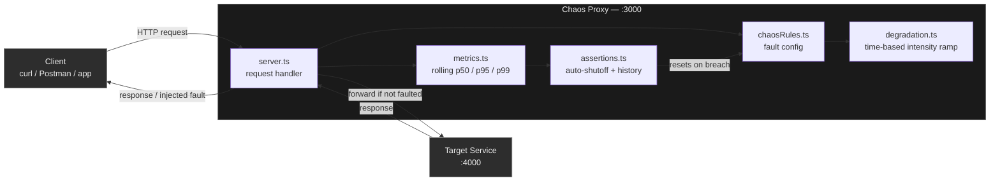

# Chaos Proxy

A hand-built HTTP proxy (Node.js + TypeScript) that sits between a client and a backend service, deliberately injecting realistic, time-varying network faults — so you can observe how a system behaves under degraded conditions, with built-in safety limits that automatically stop chaos if things break too badly.

Built from scratch using Node's raw `http` module (no `http-proxy` library), to actually understand request/response streaming rather than abstract it away behind a dependency.

## Why this exists

Real-world outages rarely happen instantly — a service degrades gradually as load increases, then recovers. Most simple fault-injection tools apply a flat, constant failure rate instead. This project models chaos as a smooth ramp over time (rising and falling, like real degradation), tracks real latency percentiles instead of misleading averages, and automatically shuts chaos off if it crosses a safety threshold — logging exactly when and why that happened.

## Architecture



**Request flow, in order:**
1. A request arrives at the proxy (`server.ts`)
2. `chaosRules.ts` provides the configured fault ceilings (max fail chance, max delay chance)
3. `degradation.ts` scales those ceilings based on where the system currently is in a repeating 60-second ramp cycle
4. If a fault is triggered: respond immediately with a fake error, or delay then continue
5. If not faulted (or after the delay): forward the request to the target service and stream the response back
6. Every outcome — success, delay, or failure — is recorded in `metrics.ts`
7. Every 2 seconds, `assertions.ts` checks the latest metrics; if failure rate or p99 latency crosses a safety threshold, chaos is automatically disabled and the event is permanently logged

## Project structure

```
chaos-proxy/
├── target-service/       # stand-in "real backend" the proxy forwards to
│   └── server.ts
├── proxy/                 # the core chaos proxy
│   ├── server.ts           # request handler, routing, orchestration
│   ├── chaosRules.ts        # mutable fault-probability config
│   ├── degradation.ts        # triangle-wave chaos intensity over time
│   ├── metrics.ts             # rolling latency percentiles + failure rate
│   └── assertions.ts           # auto-shutoff engine + trigger history
└── README.md
```

## How fault injection works

Each incoming request is checked against two independent probabilities before being forwarded:

1. **Failure injection** — if triggered, the proxy responds immediately with a fake `500` error and never even contacts the target service.
2. **Delay injection** — if triggered, the proxy pauses for a configured duration before forwarding the request normally.

Both probabilities aren't flat — they're scaled by the current position in a **60-second triangle wave** (`degradation.ts`): intensity ramps from 0 → 1 over the first 30 seconds, then back down to 0 over the next 30, repeating. This means `chaosRules.failChance` acts as a *ceiling*, reached only at peak intensity, rather than a constant rate applied at all times.

## Metrics: why percentiles, not averages

Averages hide bad experiences — a few very slow requests can be invisible in an average but show up clearly at p99. This project tracks a rolling window of the last 1000 requests and computes:
- **p50** — median latency (typical request)
- **p95 / p99** — tail latency (what your worst-off users actually experience)
- **failureRate** — proportion of requests that failed

## Safety: the assertion engine

Every 2 seconds, `assertions.ts` checks current stats against two thresholds:
- `p99 > 800ms`
- `failureRate > 30%`

If either is breached, chaos is immediately disabled (`failChance` and `delayChance` reset to `0`), and the event — timestamp, reason, and the metrics at that moment — is permanently recorded, queryable via `/history`. This prevents a chaos experiment from running indefinitely once it's clearly causing more harm than insight, and keeps an audit trail even after live stats recover.

## Running it locally

Requires Node.js. Two terminals needed.

**Terminal 1 — target service:**
```bash
cd target-service
npm install
npm run dev
```
Runs on `http://localhost:4000`

**Terminal 2 — proxy:**
```bash
cd proxy
npm install
npm run dev
```
Runs on `http://localhost:3000`, forwarding to the target service.

## API / Endpoints

| Endpoint | Method | Description |
|---|---|---|
| `/hello` | GET | Proxied through to the target service (any route forwards; this is just an example) |
| `/stats` | GET | Current rolling metrics: `{ p50, p95, p99, failureRate, total }` |
| `/history` | GET | Array of every assertion-triggered chaos shutoff: `{ timestamp, reason, p99, failureRate }` |

## Example

```bash
curl http://localhost:3000/hello
# → sometimes instant, sometimes delayed ~300ms, sometimes "Injected failure"

curl http://localhost:3000/stats
# → {"p50":1,"p95":304,"p99":311,"failureRate":0.2,"total":30}

curl http://localhost:3000/history
# → [{"timestamp":1785523185621,"reason":"failure rate too high","p99":313,"failureRate":0.667}]
```

## Configuration

Edit `proxy/chaosRules.ts` to adjust fault ceilings:
```typescript
export const chaosRules = {
  delayChance: 0.3,  // ceiling probability of injected delay
  delayMs: 300,        // delay duration in ms
  failChance: 0.2,       // ceiling probability of injected failure
};
```

## Status / Roadmap

- [x] Raw HTTP proxy (pass-through)
- [x] Fault injection (delay + failure)
- [x] Rolling latency percentile + failure rate metrics
- [x] Time-based gradual degradation (triangle wave)
- [x] Assertion engine with persistent trigger history
- [ ] REST control API (configure rules without editing code / restarting)
- [ ] Named, bounded experiments (start / stop / duration)
- [ ] Persistent (SQLite) experiment history
- [ ] Live React dashboard with real-time request feed
- [ ] Docker Compose for one-command startup

## Tech stack

- Node.js + TypeScript
- Raw `http` module for the proxy core (no proxy library)
- Express (target service only)
- Planned: SQLite, React, Socket.IO, Docker